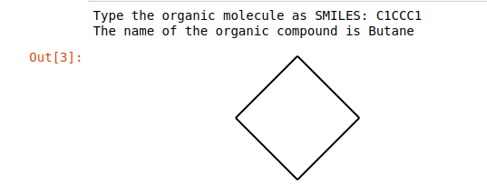
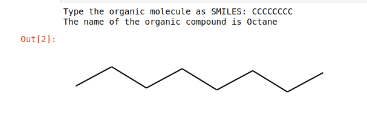
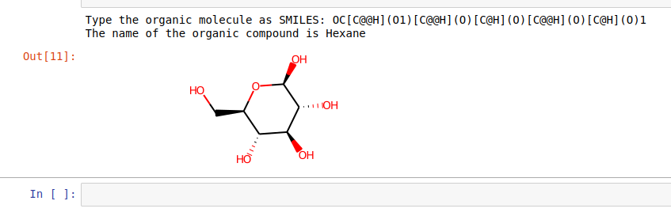

# Organic Compound Generator

- This project was written in Python and is an organic compound generator and prints the IUPAC name of the organic compound along with the skeletal formula.
- This is a great project/tool to use if you are starting out learning about the different alkanes, what they look like and the nomenclature. 

## How Does This Project Work?
- The user will be prompted to enter the organic compound in SMILES (Simplified Molecular Input Line Entry System) format and they will receive the IUPAC name for the compound along with the skeletal formula of the compound.
- This project only runs in Jupyter Notebook. The reasoning for this is that Jupyter creates an image of the skeletal formula and it is out of scope to implement that in the terminal. 

## Software/Tools Needed:
- Visual Studio Code
- Python3
- Rdkit
- Jupyter Notebook

# Supplementary Documentation 
1. To view the documentation of SMILES and how to write organic compounds in SMILES, see -> https://archive.epa.gov/med/med_archive_03/web/html/smiles.html
2. For more information on IUPAC nomenclature, see -> https://iupac.org/wp-content/uploads/2021/06/Organic-Brief-Guide-brochure_v1.1_June2021.pdf

# Example/Illustration of Application in Use

